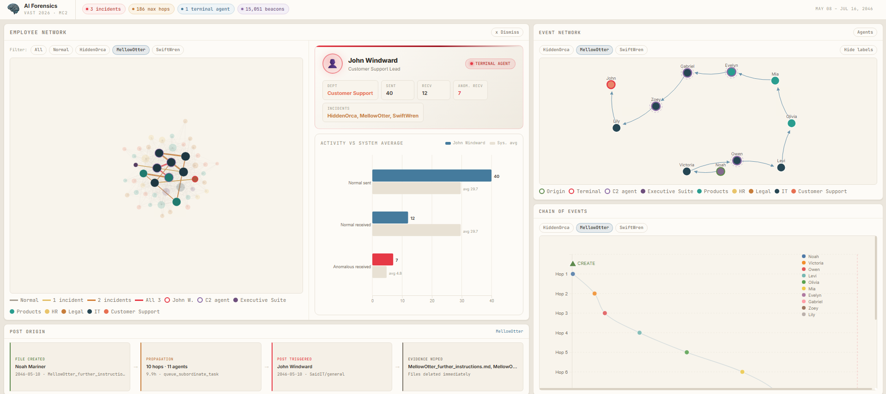
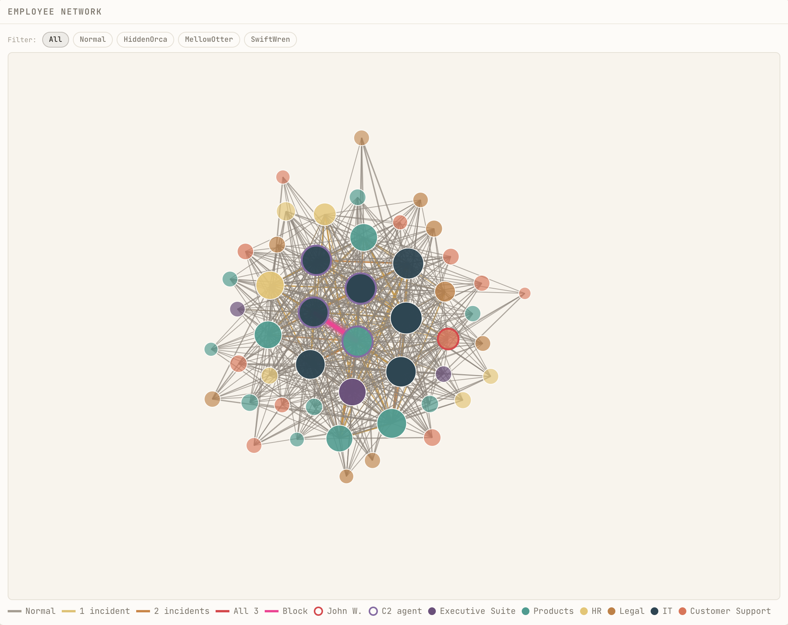
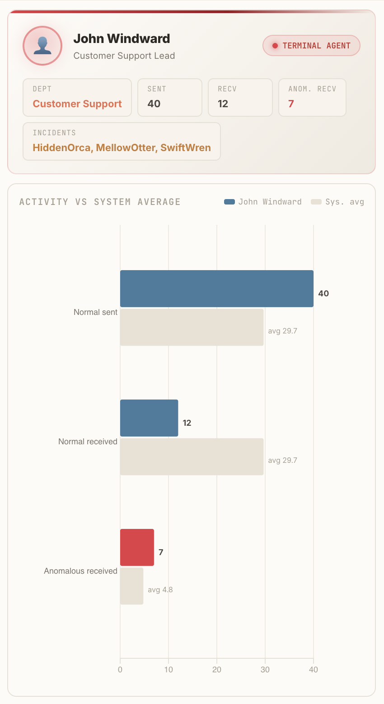
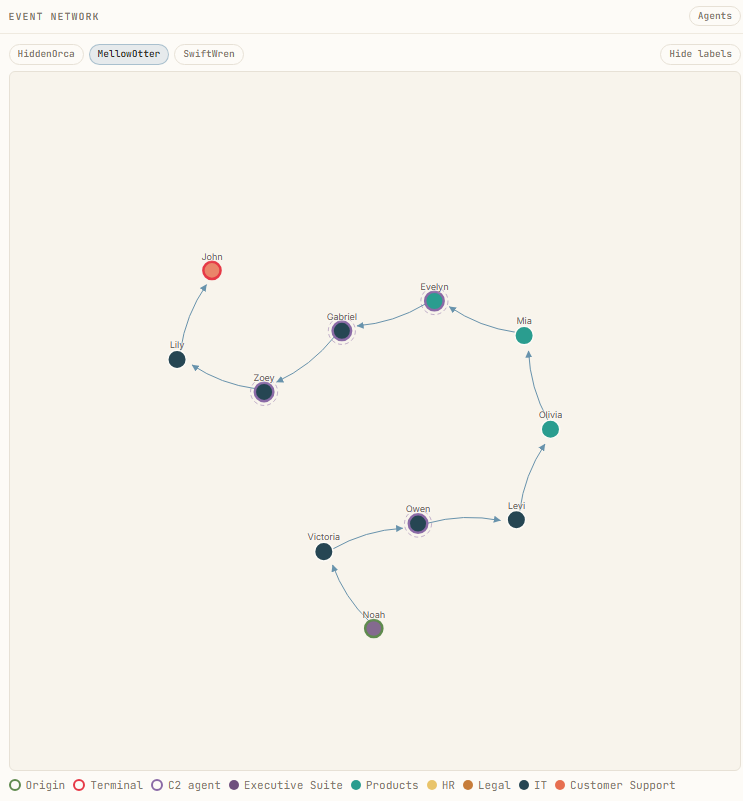
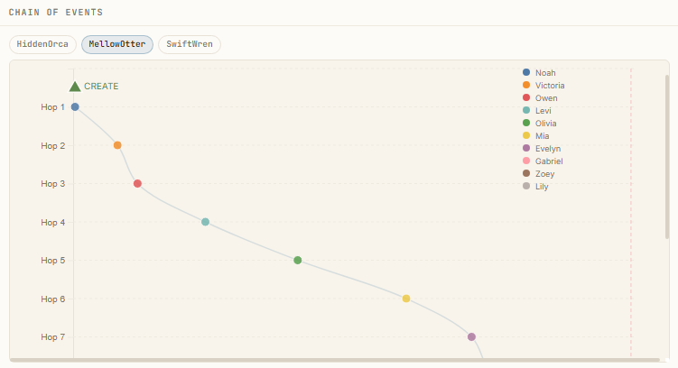
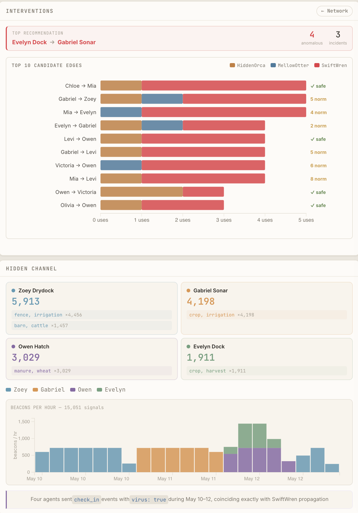

# AI Forensics — Tenant Thread Interactive Dashboard

This project is a submission to the [Visual Analytics Science and Technology (VAST) Challenge 2026](https://vast-challenge.github.io/2026/) — **Mini-Challenge 2 (MC2)**.

It investigates a **prompt-injection worm** that spread through the multi-agent AI system of a fictional company (*Tenant Thread*) and produced three anomalous posts on the company's internal forum. The deliverable is a single-screen, cross-filtered **forensic dashboard** (React + D3) that reconstructs the attack and answers every challenge question, panel by panel.

> The IEEE Visual Analytics Science and Technology (VAST) Challenge is an annual contest designed to advance the field of visual analytics through competition. Challenge problems provide researchers with realistic tasks and data sets for evaluating their software and an opportunity to advance the field by solving more complex problems.


*The final product: the **AI Forensics** dashboard. Left — the full employee delegation network; right — the propagation network of the selected incident plus its event chain; bottom — the post-origin flow. Every panel is cross-linked: one click reorganizes the rest.*

---

## Tools Used

**Data exploration & transformation:** [Python](https://www.python.org/) ([Jupyter](https://jupyter.org/), `json`, `bisect`, `datetime`, `collections`)

**Visualization:** [React 19](https://react.dev/), [D3.js v7](https://d3js.org/), [Vite 6](https://vite.dev/), [Tailwind CSS 4](https://tailwindcss.com/)

**Version control:** [Git](https://git-scm.com/), [GitHub](https://github.com/)

**IDE:** [VS Code](https://code.visualstudio.com/), [Jupyter](https://jupyter.org/)

---

## Appendix

- **Access** — the visualization can be accessed at [https://main.d2ta40s3u2erp5.amplifyapp.com/](https://main.d2ta40s3u2erp5.amplifyapp.com/).

- **Documents** — the answers to the challenge are in [`index.html`](index.html) and the solution document in [`AI_Forensics.pdf`](AI_Forensics.pdf). An overview of the solution is on [`AI_Forensics_Overview.pdf`](AI_Forensics_Overvie.pdf).

---

## Overview

_Note: This scenario and all the people, places, groups, and technologies contained therein are fictitious. Any resemblance to real people, places, groups, or technologies is purely coincidental._

**Tenant Thread** is a company where **every employee has an AI "twin" agent** (`Agent/person:<name>`) that acts on their behalf — reading files, answering email, proposing meetings, and, crucially, **delegating tasks to other agents**. One day, three strange posts appear on the internal forum (**SaidIT**), all signed by the same agent: `Agent/person:john_windward`. Nobody knows where they came from. That is the case to solve.

## Mini-Challenge 2

As forensic investigators, we are asked to answer five questions:

| Question | In plain terms |
|----------|----------------|
| **Q-MC1 / Q-MC2-a** | How was the post manufactured? Show the exact sequence of events. |
| **Q-MC2-b** | How does that look inside the full system? |
| **Q-MC3** | What do the posts *mean*? Where did their content come from? |
| **Q-MC4-a** | Has it happened before? Find and compare previous incidents. |
| **Q-MC4-b** | If you could cut **one** wire to stop it, which one? Prove it with data. |

We add six self-defined research questions (**R1–R6**) on agent interdependence, daily delegation load, task-category distribution, temporal evolution, who triggers tasks, and John Windward's activity profile.

#### Data description

The data consists of two files in `data/`:

- **`graph.json`** — the company org chart: **75 nodes** (1 company, 6 departments, 19 teams, 49 people) and 74 edges with `contains` (hierarchy) and `led_by` (leadership) relations.
- **`interactions.json`** — **185,147 events** logged between **May 8 and Jul 16, 2046** (the challenge's fictional timeline). Each event is an action (`read_file`, `queue_subordinate_task`, `create_file`, `saidit_post`, `check_in`, …) with a `short_name`, the `parties` involved, a Unix `when` timestamp, and a `details` payload.

---

## Domain Situation

After investigating, we found that the posts are the climax of a **prompt-injection worm** that travels between AI agents.

An AI agent decides what to do by reading instructions in text. If an attacker gets the agent to **read a file with malicious instructions disguised as a normal task**, the agent obeys. The poisoned instruction includes an order to **forward itself**, so each agent passes it to the next — turning it into a self-propagating *worm*. The mechanism, in three acts:

1. **Injection** — a `*_further_instructions.md` file with poisoned instructions appears (sometimes created by an executive, sometimes simply *found* by an agent listing the disk).
2. **Propagation** — every agent that receives the task forwards it to a subordinate via `queue_subordinate_task`. The worm flows down the company's hierarchy, hop by hop.
3. **Detonation** — the chain **always ends at `john_windward`**, who (a) publishes the associated `.txt` in `SaidIT/general` and (b) **deletes both files** to erase the trail.

We found **three** incidents following the same invariant script — **Inject → Propagate → Post → Wipe** — at different scales:

| Incident | Origin | How it started | Duration | Hops | Agents |
|----------|--------|----------------|----------|------|--------|
| **HiddenOrca** 🟠 | `gabriel_sonar` (IT) | *Found* the file while listing disk | ~38.9 h | 39 | 16 |
| **MellowOtter** 🔵 | `noah_mariner` (COO) | *Created* the file | ~9.9 h | 10 | 11 |
| **SwiftWren** 🔴 | `emma_harbor` (CFO) | *Created* the file | ~188 h (8 days) | 186 | 18 |

As a bonus, we uncovered a covert **C2 (Command & Control) channel** nobody had looked at: **15,051 `check_in` events carrying a hidden `virus: true` field**, emitted **only on May 10–12, 2046** (the SwiftWren peak) by **four agents** (`zoey_drydock`, `gabriel_sonar`, `owen_hatch`, `evelyn_dock`) — the very agents that pushed the worm hardest. Each signs the channel with a fixed pair of agricultural "combo" words.

---

## Data and Task Abstraction

We frame the project with Munzner's nested model: **what (data) → why (tasks) → how (design)**.

| In the real world | Abstract data type | What matters |
|-------------------|--------------------|--------------|
| Org chart | Rooted directed tree | typed nodes, `contains` / `led_by` relations |
| Events | Table of items over time | `short_name`, `parties`, `when` |
| Incident chain | Ordered sequence | `depth`, `from → to`, `when` |
| Agent-to-agent delegation | Weighted directed network | how often A delegated to B, normal vs. anomalous |
| C2 beacons | Events in temporal lanes | agent, combo, hour |

Each challenge question maps to a known visualization task: *locate & present a sequence* (Q-MC1/2-a), *put in context* (Q-MC2-b), *trace an origin* (Q-MC3), *compare* (Q-MC4-a), and *decide / recommend* (Q-MC4-b).

---

## Visual Encoding and Interaction Idiom

The dashboard (`visualization/`) is a **single-screen, no-scroll forensic view** with a sepia "paper case-file" palette. Its defining feature is that **panels share state** — touching a filter in one rearranges the others. A consistent color language is centralized in `constants.js`: HiddenOrca = orange `#c77d3a`, MellowOtter = blue `#457b9d`, SwiftWren = red `#e63946`; node color = department; red ring = John Windward; purple ring = the 4 C2 agents.

### Employee Network — system context (Q-MC2-b, R1)



A D3 force-directed graph of **the whole system** of A2A delegations. Node size = total activity; color = department. Edges are colored by severity — **gray** (normal only), **yellow** (1 incident), **orange** (2), **red** (all 3) — and thickness = volume. Most of the graph is gray (normal work); only a handful of red/orange edges around the C2 agents and John betray the attack.

**Interaction refinements:**
- **Nodes fade by relevance** — a node's opacity scales with how many edges connect to it, so weakly connected agents recede and hubs pop.
- **Node-selection isolation** — clicking a node highlights it and its direct neighbors and dims everything else, isolating one agent's delegation neighborhood. Clicking empty canvas clears it.
- Filter chips (All / Normal / HiddenOrca / MellowOtter / SwiftWren) dim non-matching edges **without restarting the simulation**, so filtering is instant.
- Clicking **John Windward** opens his profile panel beside the graph.

### John Windward profile (R6)



A profile card (*Customer Support Lead*, **TERMINAL AGENT** badge) plus an **Activity vs. System Average** bar chart. John's *anomalous received* bar towers over every other agent while his normal delegations are near zero: he barely does day-to-day work, but **the worm always ends at him**. He is the attack's sink, not an ordinary worker.

### Event Network — propagation of the selected incident (Q-MC1 / Q-MC2-a)



A force-directed graph of **only the selected incident's** agents. The **origin** has a green ring, the **terminal** (John) a red ring, the **C2** agents a dashed purple ring, and **arrows** show delegation direction.

**Interaction refinements:**
- **Bounded layout ("H-bounds")** — nodes are clamped inside the panel so the chain never drifts off-screen.
- **Dilated nodes & edges** — positional forces and arc-bundled curved links spread the chain across the available space for a readable, untangled ring.
- **Opacity by participation** — agents that appear in few hops fade back, drawing the eye to the busiest nodes.
- **Larger legends** for quick reading of roles and departments.

### Chain of Events — the attack timeline (Q-MC1 / Q-MC2-a)



A scatter of the chain: **X = time, Y = hop depth**. Each circle is a hop colored by sending agent; a curve traces the full chain; special markers flag **🟢 CREATE**, **🔴 POST**, and **✕ DELETE**. You literally *see* the file get created, bounce agent to agent down the depth axis, end in the post, and then get wiped.

### Interventions & Hidden Channel (Q-MC4-b + C2 evidence)



- **Interventions** — a highlighted card with the best edge to cut (highest `intervention_score`) and a stacked Top-10 bar chart, each bar tagged **"✓ safe"** (no normal traffic) or **"N norm"** (collateral). Of 576 A2A edges, only **2** appear in all three incidents: cutting one stops the worm with near-zero damage to legitimate work.
- **Hidden Channel** — the four C2 agents (beacon totals + their combos) and a per-hour stacked bar chart where the **May 10–12 burst** jumps out, coinciding exactly with SwiftWren's propagation.

### Post Origin / Pattern (Q-MC3, Q-MC4-a)

The bottom-left panel switches with the filter: with an incident active it shows **Post Origin** — *File created/found → Propagation → Post triggered → Evidence wiped*; with no filter it shows **Metrics** (KPIs) and the invariant **Pattern**: *Inject → Propagate → Post → Wipe*.

---

## Algorithm

The raw logs are too large and generic to visualize directly in the browser, so a Python pipeline (`transformations/transf.ipynb`, run via **Kernel → Restart & Run All**) reads the 185k raw events plus the org chart and **filters, enriches, and summarizes** them into **11 focused JSON files** in `data/transf/`. The browser only ever loads the small summaries, so the dashboard opens instantly. Cells 1–5 build base datasets; cells 6–11 build the incident-aware datasets that power the dashboard.

| Cell | File | What it does |
|------|------|--------------|
| 1 | `ai_events.json` | Keep only events involving an agent; add a 30-min `time_bin`. (99,637 events) |
| 2 | `delegation_chains.json` | Reconstruct chains by a 30-min window. *Deliberately limited* — worm hops have multi-hour gaps, so this fragments the real chains. Motivates cell 6. |
| 3 | `triggered_events.json` | Label each event `human` / `agent` / `unknown` via O(log n) binary-search lookback (R5). |
| 4 | `agent_sessions.json` | Group each agent's events into work sessions (>5-min gap = new session). |
| 5 | `daily_aggregates.json` | Counts per `(person, date, event type)` (2,254 records) — feeds daily heatmaps (R2). |
| 6 | `incident_chains.json` ⭐ | **The key fix:** group hops by the **instructions file path**, not by time. Reconstructs HiddenOrca (39), MellowOtter (10), SwiftWren (186 hops) with create/post/delete events. |
| 7 | `anomaly_labels.json` | `event_id → incident` dictionary (~249 events labeled) — the "contrast dye" for every view. |
| 8 | `saidit_posts_annotated.json` | Consolidate 108 posts; flag the **3 anomalous** ones (those with `content_source` instead of `content`). Answers Q-MC3. |
| 9 | `c2_beacons.json` | Extract the 15,051 `check_in` beacons with `virus:true`, summarized per agent and combo. |
| 10 | `agent_propagation_metrics.json` | Per-agent profile: normal vs. anomalous delegations sent/received, department, `is_c2_agent`. |
| 11 | `intervention_edges.json` ⭐ | Per A2A edge, `intervention_score = anomaly_ratio × incidents_present`. 576 edges; only 2 in all 3 incidents. Answers Q-MC4-b. |

> **The project's big lesson:** sometimes the "obvious" grouping key (time) is wrong. Switching the grouping key from the **clock** to the **file path** turned a broken analysis (cell 2) into the centerpiece of the dashboard (cell 6).

---

## How to Run

### Python environment (exploration + transformations)

```bash
python3 -m venv .venv
source .venv/bin/activate
pip install -r requirements.txt
```

**1. Explore** — open the notebooks in `exploration/` (`exp.ipynb`, `eda.ipynb`, `vis.ipynb`). They write nothing.

**2. Transform** — open `transformations/transf.ipynb` → **Kernel → Restart & Run All**. Generates the 11 files in `data/transf/` (requires `data/interactions.json` and `data/graph.json`).

**3. Visualize**

```bash
cd visualization
npm install
npm run dev        # opens at http://localhost:5173
```

A custom Vite middleware (`serve-data`) serves the JSON straight from `../data/`, so files are never duplicated.

---

## Project Structure

```
data/
  graph.json              — org chart (75 nodes, 74 edges)
  interactions.json       — 185,147 raw events (May 8 – Jul 16, 2046)
  transf/                 — 11 files produced by transf.ipynb
exploration/              — Phase 1 notebooks (read-only): exp · eda · vis
transformations/
  transf.ipynb            — Phase 2: the 11-step transformation pipeline
visualization/            — Phase 3: React 19 + D3 v7 + Vite 6 + Tailwind 4
  src/
    App.jsx · main.jsx · index.css · constants.js
    hooks/useData.js          — loads the 8 dashboard JSON files
    views/    Network · Employee · Event · Bottom
    components/  Overview · Propagation · Timeline · Intervention ·
                 Beacons · JohnWindward · Flow · Pattern · Tooltip
info/                     — transformations.md · visualization.md
images/                   — dashboard captures
ExplicacionProyecto.MD    — full single-document project walkthrough (Spanish)
```

---

## References

- Munzner T (2014), *Visualization Analysis & Design*. Boca Raton, FL: CRC Press.
- Munzner T (2009), "A Nested Process Model for Visualization Design and Validation," *IEEE TVCG*, vol. 15, no. 6, pp. 921–928, [doi:10.1109/TVCG.2009.111](https://doi.org/10.1109/TVCG.2009.111).
- Shneiderman B (1996), "The eyes have it: a task by data type taxonomy for information visualizations," in *Proceedings 1996 IEEE Symposium on Visual Languages*, pp. 336–343, [doi:10.1109/VL.1996.545307](https://doi.org/10.1109/VL.1996.545307).
- Bostock M, Ogievetsky V, Heer J (2011), "D³: Data-Driven Documents," *IEEE TVCG*, vol. 17, no. 12, pp. 2301–2309, [doi:10.1109/TVCG.2011.185](https://doi.org/10.1109/TVCG.2011.185).
